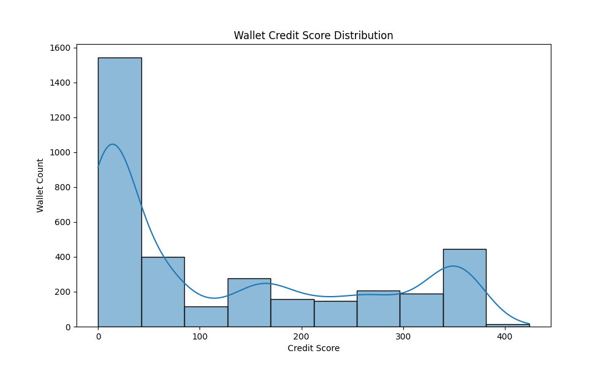

# Wallet Credit Score Analysis

## Overview

This analysis aims to evaluate the behavior and reliability of DeFi wallets using transaction data from Aave V2. A credit score between 0 and 1000 is assigned to each wallet based on activity patterns, token flow behavior, and recency of usage.

---

## Feature Engineering

Each wallet's score is derived from a combination of the following features:

### Raw Features:
- **tx_count**: Number of transactions.
- **unique_actions**: Number of distinct transaction types (e.g., deposit, borrow).
- **total_usd_value**: Total USD-equivalent value transacted.
- **avg_usd_value**: Average USD value per transaction.
- **days_since_last_tx**: How recently the wallet was active.
- **deposit_redeem_ratio**: Ratio of redeem to deposit amounts.
- **borrow_repay_ratio**: Ratio of repay to borrow amounts.

### Behavior Ratios:
Ratios close to `1` indicate balanced behavior:
- A borrow/repay ratio ≈ 1 shows responsible loan usage.
- A deposit/redeem ratio ≈ 1 indicates consistent liquidity flow.

---

## Scoring Methodology

Each feature is normalized between 0 and 1:
- Normalization: `(value - min) / (max - min + ε)`

The final credit score is a weighted combination of:
- `tx_count_score`: Activity level (40%)
- `recency_score`: Recent engagement (20%)
- `behavior_score`: Combined balance from ratios (20%)
- `unique_actions_score`: Diversity of DeFi interaction (20%)

The final output is scaled to a **0–1000** range:
```python
credit_score = int(final_score * 1000)
```

## Score Distribution Insight

### 📷 Sample Score Distribution



The score distribution is highly right-skewed, with the majority of wallets scoring below **100**. This suggests that most wallets show limited activity, poor recency, or unbalanced transaction behavior. A smaller number of wallets achieve moderate scores (100–400), and very few demonstrate consistently healthy activity to score higher.

This skew reflects typical behavior in DeFi platforms, where a large portion of addresses may be inactive, one-time users, or bots.


## Applications

These credit scores can be used for:
- Filtering high-trust wallets for DeFi lending
- Analyzing protocol engagement quality
- Detecting inactive or risky wallets
